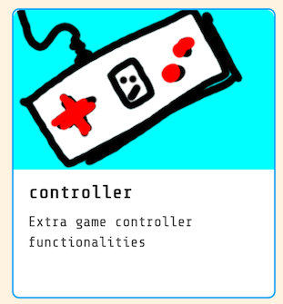
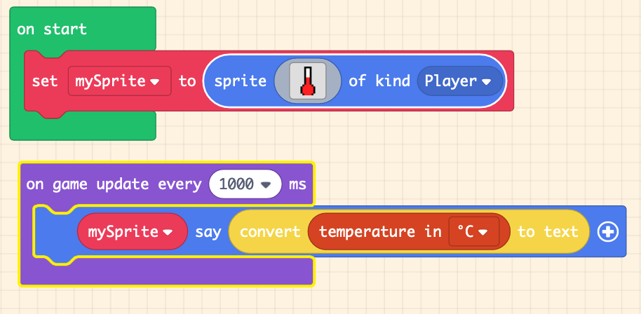
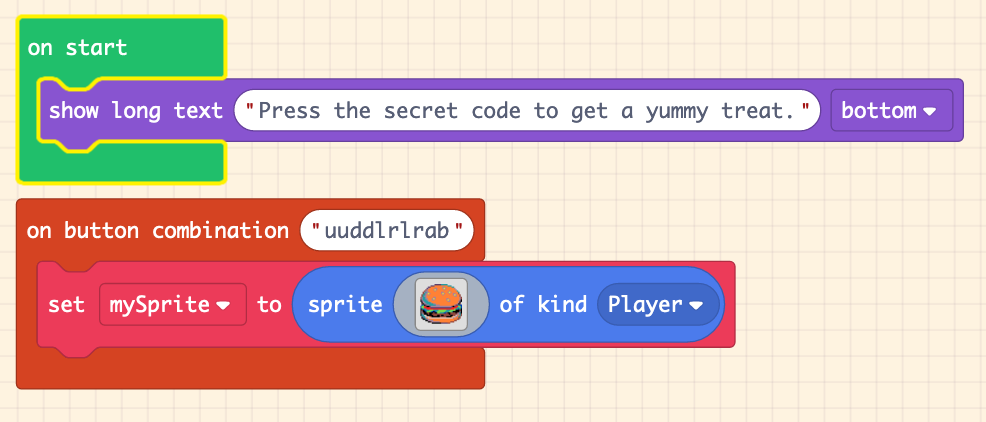

# meowbit-docs

Bonus docs for using MakeCode Arcade with the MeowBit

The [MeowBit](https://www.kittenbot.cc/products/meowbit-codable-console-for-microsoft-makecode-arcade) is a little 
gameboy like device that you can program using MakeCode Arcade, Python, or KittenBot's version of Scratch. It has
buttons, several sensors, can run on a battery, and you can make your own games for it through the web. This repo
will cover everything I've learned about using it with MakeCode Arcade. I don't plan to cover Python or Scratch. (yet)  

You can buy the MeowBit from KittenBot's website or one of several resellers. I got ours from Adafruit.

# Getting Started

First you should learn [MakeCode Arcade](https://arcade.makecode.com/), which does not require any hardware at 
all to use, and can work with several different devices. Once you've created a program you can 
click the download button in your projects to compile 
it into a .uf2 file.  This is the actual binary that goes on your device.  Plug your MeowBit into your computer using USB. It should
automatically mount as a flash drive. Drag the downloaded .uf2 file to the drive. The MeowBit will automatically disconnect
and load the game. It's that easy.

## Learning MakeCode Arcade

The MakeCode Arcade lessons are great for learning how to code and build games.  I went through the
[CS Intro 1 course](https://arcade.makecode.com/courses/csintro1) with my 8yr old kid and he loved it.
He's now making fun little games all by himself.   The courses cover using events, logic, loops,
animating sprites, creating a tilemap, and simple audio.

# Advanced Usage

I found very little specific to using MeowBit with MakeCode arcade, in particular the sensors. So that's 
what I'm covering here.

## Sensors

The MeowBit has built in sensors for light, temperature, and a gyroscope/accelerometer.  You can use them
with the **Controller** extension. This extension will give you extra blocks in the 'Controller' category.

### Light

The built in light sensor is just below the switch in the top center of the MeowBit screen. The light value
is a number between 0 and 255. There are blocks to: 

* get the current light level with the `light level` block.
* detect light level changes with the `on light [dark]` block.

This example creates a lightbulb sprite. Every second it makes
the sprite *say* the current light level.  If the light becomes
*dark* then it says 'It got dark'. 

 

[live example](https://makecode.com/_3XbUYE2VdH8e)

 
### Temperature

The temp sensor works similarly to the light sensor. On the MeowBit the physical sensor is near the D-pad. 
The sensor is not very accurate and is probably skewed by having the silicon case on it, but it should be enough
for simple tests.  Add the same *Controller* extension to get the temp sensor blocks.

* get the current temp as Fahrenheit or Celsius.

The example below shows the current temp once a second.

[live example](https://makecode.com/_UTyR9tft0YVY)

### Gyroscope / Tilt sensor
 
The gyroscope can also be accessed from the *Controller* extension.  There are two blocks which do:

* `on shake`, called whenever the meowbit is physically shaken. You can change the event to look for
tilt left, tilt right, etc, as well as the general strength in terms of gravity. This could be useful
for detecting when the Meowbit is dropped or hit.
* `acceleration`, to get the current value of the sensor. You can get the x, y, z or strength (which I think is an average).
The acceleration is a value from -1024 to +1024 for each direction.
* When you add any code which uses the gyro the simulator will get a new tilt ability. Just move your mouse over
the simulator to 'tilt' it in different directions. Great for quickly testing out your code.

[live example](https://makecode.com/_J3w887E2eAH1)

## Button Combos

* There is an extension called *button-combos*. It lets you work with sequences of button presses. I've only
used the `on button combination` block so far, but there are many other blocks.

Here's an example that shows a hamburger when the player presses the [Konami Code](https://en.wikipedia.org/wiki/Konami_Code).

[live example](https://makecode.com/_0EcemFEiWfi3)

## Fades and Palette Shifts

* Palette shift and color fade

## Multi-player

There are two ways to do multi-player with the MeowBit. First, you can have each user use 
different buttons on the same device. This is will be annoying on the MeowBit since both 
of you will be trying to hold the device. For turn based games you could hand it back and forth. 
The Battleship-like [Salvo game](https://forum.makecode.com/t/presenting-salvo/199) by AlexK does this.

The other way is by physically connecting two MeowBits. *They have what appears to be a headphone jack. 
It is not!  In fact, do not plug in real headphones. It might fry them.* 

This connector is for the JACDAC connection, which is a new protocol to send information between multiple
devices over a single wire. The JACDAC blocks handle this. In practice 
the code seems to be very alpha and doesn't work very well. My son was able to create a little example
that sends a hard coded message from one MeowBit to another, but the sending didn't work every time. 
Sometimes we had to send a message multiple times before it was received.  I'm not going
to put an example here until the code is more stable.

## SD Card

The MeowBit has a full size SD Card slot which, according to the docs, is for *store programs or extend wireless modules)*. I have found no documentation on how to use it, or indication that it works at all.
I sent an email to the MeowBit manufacturers to see if it was ever turned on. For now I assume it does not
do anything.

* Seven segment
* Storyboard only JS

## Storyboard

There 

